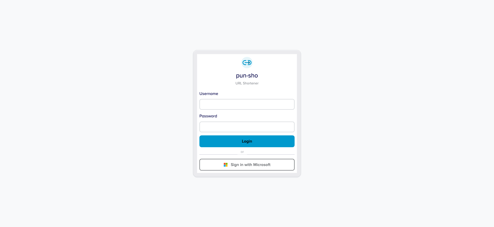
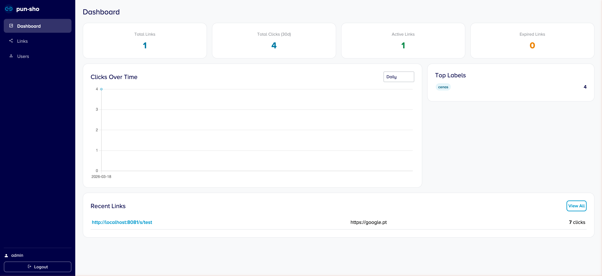
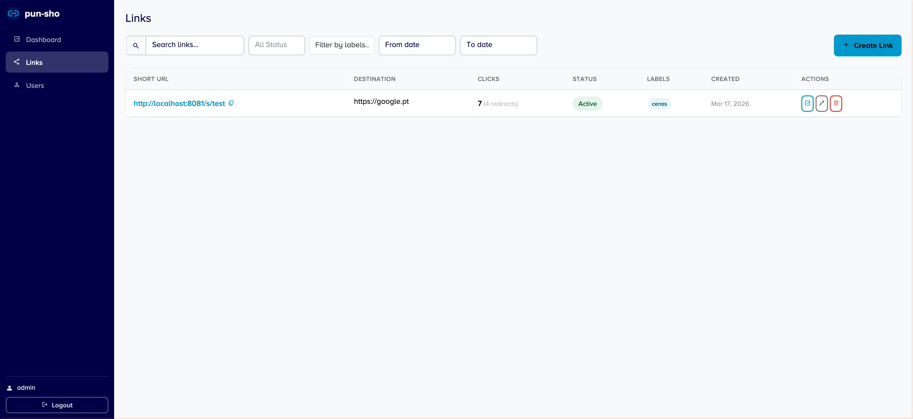
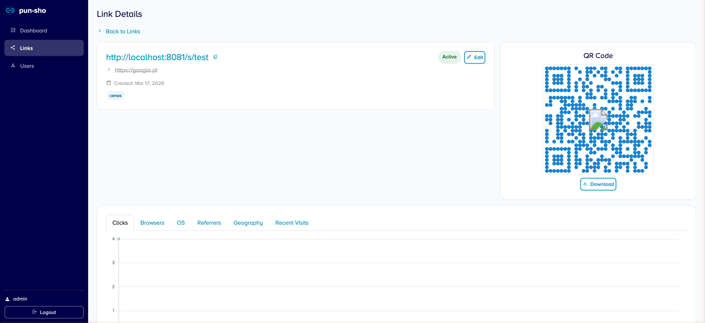
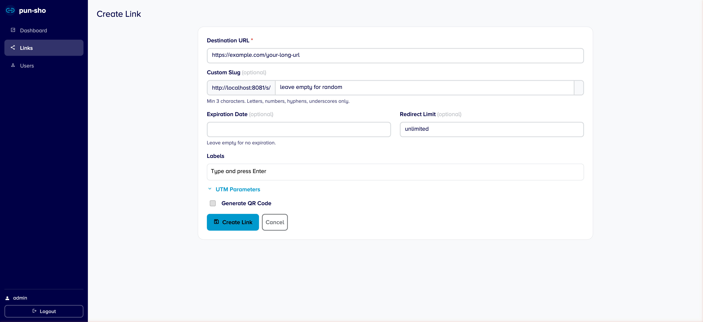

# pun-sho

[](https://github.com/doutorfinancas/pun-sho/releases)
[](https://circleci.com/gh/doutorfinancas/pun-sho)
[](https://codecov.io/gh/doutorfinancas/pun-sho)
[](https://github.com/doutorfinancas/pun-sho/actions)
[](LICENSE)
[](https://www.codefactor.io/repository/github/doutorfinancas/pun-sho)

PUNy-SHOrtener - Yet Another URL Shortener


Spelled pan&#8231;cho - &#x02C8;p&#x00E3;n&#x02B2;.t&#x0361;&#x0283;o

## But, Why?


props to [XKCD](https://xkcd.com/927/)

We decided that we need something that doesn't exist on every other project (mix all of them, and you would have it).

So, we decided to make yet another URL shortener.

## Features

### URL Shortening API
- Create short links with custom slugs, TTL, redirection limits, and labels
- QR code generation (SVG/PNG) with customizable colors, shapes, and logo overlay
- Visit tracking with browser, OS, referrer, and geo-location data
- Bot filtering with configurable social media bot allowlist
- Soft-delete links (never hard-deleted)
- Label-based organization and filtering

### Admin Web Interface

A full-featured web admin panel accessible at `/app/` with session-based authentication.

#### Login



Supports two authentication methods (at least one must be enabled):
- **Local login** &mdash; username and password with optional TOTP two-factor authentication
- **Microsoft SSO** &mdash; OpenID Connect via Azure AD, with optional group-based access control

Local login can be disabled via `DISABLE_LOCAL_LOGIN=true` to enforce Microsoft-only authentication.
If Microsoft OAuth credentials are not configured, local login remains enabled regardless of the setting.

#### Dashboard



The dashboard provides an at-a-glance overview of your shortener:
- **Stats cards** &mdash; total links, total clicks (last 30 days), active links, expired links
- **Clicks over time** &mdash; interactive Chart.js line chart with daily/weekly/monthly granularity toggle
- **Top labels** &mdash; ranked list of most-used labels by click count
- **Recent links** &mdash; quick-access table showing the latest created links

#### Links List



A table of all short links with a full filter toolbar:
- **Search** &mdash; text search with debounced HTMX requests
- **Status filter** &mdash; dropdown to filter by Active, Expired, or Deleted
- **Label filter** &mdash; multi-select powered by Tom Select with chip-style removable tags, populated from existing labels in the database
- **Date range** &mdash; native date pickers to filter links by creation date
- **Actions** &mdash; view details, edit, or soft-delete each link directly from the table

All filters are combined with AND logic and update the table in real-time via HTMX without page reload.

#### Link Details



Detailed analytics for a single link, including:
- Link metadata (short URL, destination, status, creation date, labels)
- QR code preview with download button
- **Analytics tabs** (all HTMX-loaded):
  - Clicks over time (chart with granularity control)
  - Browser breakdown
  - Operating system breakdown
  - Top referrers
  - Geographic distribution (country + city, powered by GeoIP)
  - Recent visits log (IP, browser, OS, status, country)

#### Create / Edit Link



Form to create or edit short links with:
- Destination URL
- Optional custom slug (validated for uniqueness and format)
- Labels (tag input)
- TTL (expiration date/time)
- Redirection limit
- UTM parameter builder (source, medium, campaign, term, content)
- QR code configuration (enable/disable, shape, colors, logo upload, format)

#### User Management

Admin-only page (`/app/users`) for managing user accounts:
- Create new users with username, email, password, and role
- Toggle user roles (user/admin)
- Reset passwords
- Delete users
- View TOTP and Microsoft SSO link status per user

## Usage

You can clone this repo or use one of the precompiled binaries available in the release section.

You can also use docker, pre-made images are available for you at `docker pull ghcr.io/doutorfinancas/pun-sho:latest`
or you can:
```bash
# this API_PORT is defined in .env file or put it in env itself
export API_PORT=8080
docker run --env-file=.env -p 8080:${API_PORT} -t ghcr.io/doutorfinancas/pun-sho:latest pun-sho
```

You should also copy the `.env.example` to `.env` and fill the values for the database.
You can use either `cockroach` or `postgres` as value for the `DB_ADAPTOR`.

If you want to use `cockroach`, you can create a free account [here](https://cockroachlabs.cloud/).

### Configuration

All configuration is done via environment variables (see `.env.example`):

| Variable | Description | Default |
|----------|-------------|---------|
| `API_PORT` | Server port | `8080` |
| `HOST_NAME` | Public-facing base URL | |
| `AUTH_TOKEN` | API bearer token for `/api/v1/*` endpoints | |
| `DB_USERNAME`, `DB_PASSWORD`, `DB_NAME`, `DB_URL`, `DB_PORT` | Database connection | |
| `SSL_MODE` | PostgreSQL SSL mode | |
| `PUBLIC_ID_LENGTH` | Length of generated short IDs | `10` |
| `QR_PNG_LOGO` | Path to logo image overlaid on QR codes | |
| `ALLOWED_SOCIAL_BOTS` | Comma-separated bot names allowed through (e.g. `facebookexternalhit,googlebot`) | (none) |
| `ADMIN_DEFAULT_PASSWORD` | Password for the auto-created `admin` user on first start | |
| `COOKIE_DOMAIN` | Cookie domain for session auth | `localhost` |
| `SESSION_DURATION` | Session lifetime (Go duration string) | `48h` |
| `DISABLE_LOCAL_LOGIN` | Set to `true` to hide username/password login (requires Microsoft OAuth) | `false` |
| `MICROSOFT_TENANT_ID` | Azure AD tenant ID for SSO | |
| `MICROSOFT_CLIENT_ID` | Azure AD application client ID | |
| `MICROSOFT_SECRET` | Azure AD client secret | |
| `MICROSOFT_ALLOWED_GROUPS` | Comma-separated Azure AD group IDs to restrict access | |
| `GEOIP_DB_PATH` | Path to MaxMind GeoLite2-City.mmdb file | |
| `GEOIP_LICENSE_KEY` | MaxMind license key (auto-downloads DB on first start) | |

### API Examples

#### Create a short link
```bash
read -r -d '' BODY <<EOF
{
  "link": "https://www.google.pt/",
  "TTL": "2023-03-25T23:59:59Z",
  "redirection_limit": 5,
  "labels": ["marketing", "campaign-q1"],
  "qr_code": {
    "create": true,
    "width" : 50,
    "height": 50,
    "foreground_color": "#000000",
    "background_color": "#ffffff",
    "shape": "circle"
  }
}
EOF

# you could use "background_color": "transparent" to request a png without background
# by setting env property QR_PNG_LOGO to a png filepath,
# it will overlay the logo on qrcode center

curl -XPOST http://localhost:8080/api/v1/short \
  -H 'token: ThisIsA5uper$ecureAPIToken' \
  -H 'Content-Type: application/json' \
  -d $BODY
```

This would render an answer like:
```json
{
  "id":"4b677dfe-e17a-46e7-9cd2-25a45e8cb19c",
  "link":"https://www.google.pt/",
  "TTL":"2023-03-25T23:59:59Z",
  "redirection_limit": 5,
  "created_at":"2023-03-20T10:50:38.399449Z",
  "deleted_at":null,
  "accesses":null,
  "qr_code": "data:image/png;base64,ASfojih134kjhas9f8798134lk2fasf...",
  "short_link":"https://env.configured.domain/s/SEdeyZByeP",
  "visits":0,
  "redirects":0
}
```

#### Edit a short link
It's also possible to edit a shortlink, by using the PATCH method

```bash
read -r -d '' BODY <<EOF
{
  "link": "https://www.google.pt/",
  "TTL": "2023-03-25T23:59:59Z",
  "redirection_limit": 5,
  "cancel": false
}
EOF

curl -XPATCH http://localhost:8080/api/v1/short/4b677dfe-e17a-46e7-9cd2-25a45e8cb19c \
  -H 'token: ThisIsA5uper$ecureAPIToken' \
  -H 'Content-Type: application/json' \
  -d $BODY
```

#### Preview QR code
If you want to preview the QR code only, you can use the preview endpoint with the same body as above.
No TTL exists in that endpoint though (as it's only preview mode), and the link is exactly the one you sent.
```bash
read -r -d '' BODY <<EOF
{
  "link": "https://www.google.pt/",
  "qr_code": {
    "create": true,
    "width" : 50,
    "height": 50,
    "foreground_color": "#000000",
    "background_color": "#ffffff",
    "shape": "circle"
  }
}
EOF

curl -XPOST http://localhost:8080/api/v1/preview \
  -H 'token: ThisIsA5uper$ecureAPIToken' \
  -H 'Content-Type: application/json' \
  -d $BODY
```

#### Get statistics from a visited link
```bash
curl -H 'token: ThisIsA5uper$ecureAPIToken' http://localhost:8080/api/v1/short/c62cbe57-7e45-4e87-a7c1-11cfb006870b
```

#### Get a list of links
```bash
curl -H 'token: ThisIsA5uper$ecureAPIToken' "http://localhost:8080/api/v1/short/?limit=20&offset=0"
```

Filter by labels:
```bash
curl -H 'token: ThisIsA5uper$ecureAPIToken' "http://localhost:8080/api/v1/short/?labels=marketing,promo"
```

#### Delete a link
```bash
curl -H 'token: ThisIsA5uper$ecureAPIToken' -XDELETE http://localhost:8080/api/v1/short/c62cbe57-7e45-4e87-a7c1-11cfb006870b
```

## Tests

You can execute all the tests of the application by using `make test`.

If you want to only execute one of the types we have, then you can run:
- `make test/go` for Go tests
- `make test/http-requests` for http-requests tests
(uses Docker but you can, locally, execute them through Intellij IDEA or through [http-client cli](https://www.jetbrains.com/help/idea/http-client-cli.html)).

## DB Migrations

This project uses database migrations.
For any changes on the DB structure to be dealt with or replicated or rolled-back we use a [migration tool](https://github.com/golang-migrate/migrate).

### Install golang-migrate
```shell
# cockroach
go install -tags 'cockroachdb' github.com/golang-migrate/migrate/v4/cmd/migrate@latest
# postgres
go install -tags 'postgres' github.com/golang-migrate/migrate/v4/cmd/migrate@latest
```

### Create new migration files
```shell
make migration/create
```

### Migrate
To go versions up:
```shell
make migration/up
```

To go versions down:
```shell
make migration/clean
```

## Releases

We are currently working actively in the project and as such there still isn't a closed API.

However, we are already using it in production, in our own projects.

We consider this to be an MVP and as such use it at your own risk.

We will be releasing 0.X until we bind a contract to the API.

## Next Steps
- [ ] Define stable contract version
- [x] Add GUI (web based) with:
  - [x] Login page (local + Microsoft SSO)
  - [x] Dashboard with overview
  - [x] Ability to track a specific link data
  - [x] Show list of links with filters (by label, date range, status)
- [x] Allow better security (session auth, TOTP 2FA, Microsoft SSO)
- [x] Add GitHub pages with openapi/swagger definition #19
- [ ] Add pagination to links list
- [ ] Search by destination URL / slug
